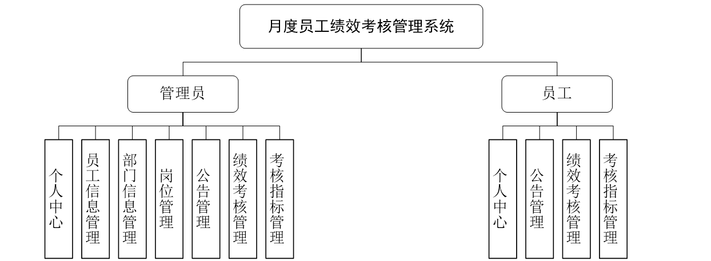
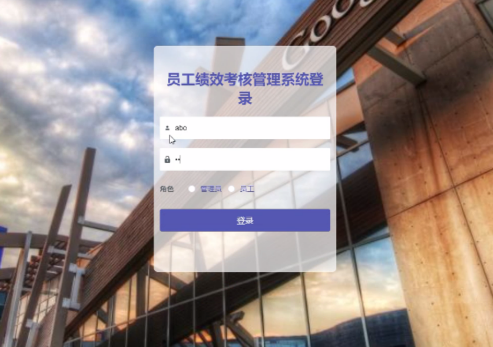
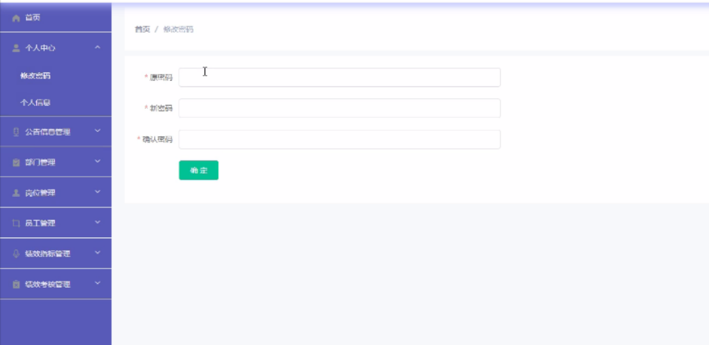
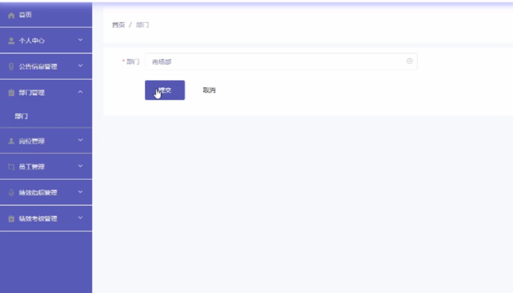
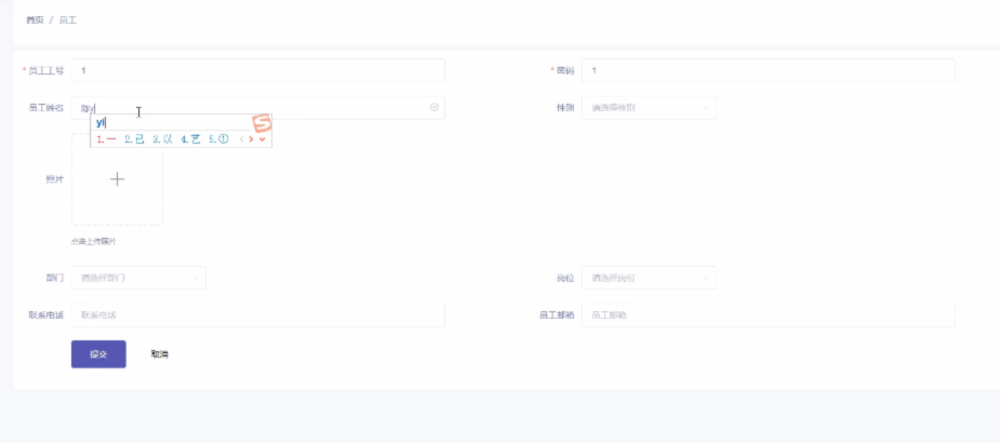
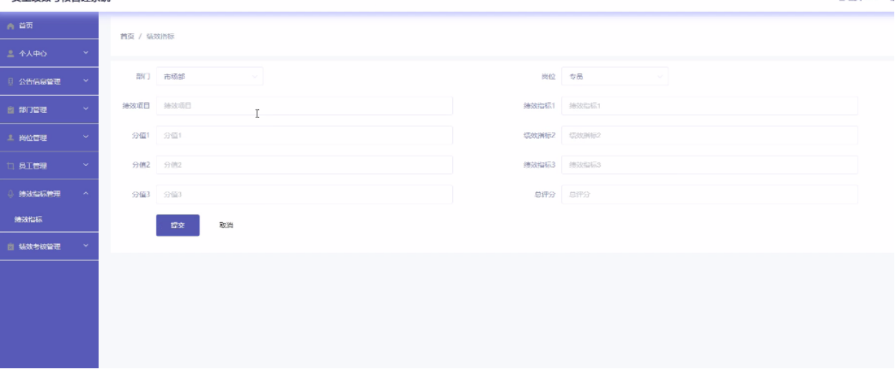
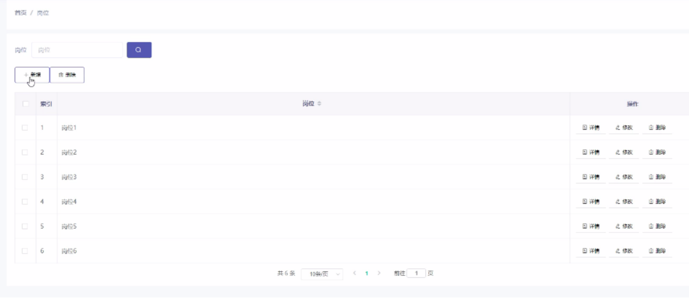
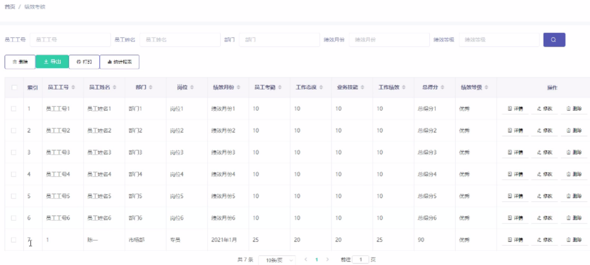
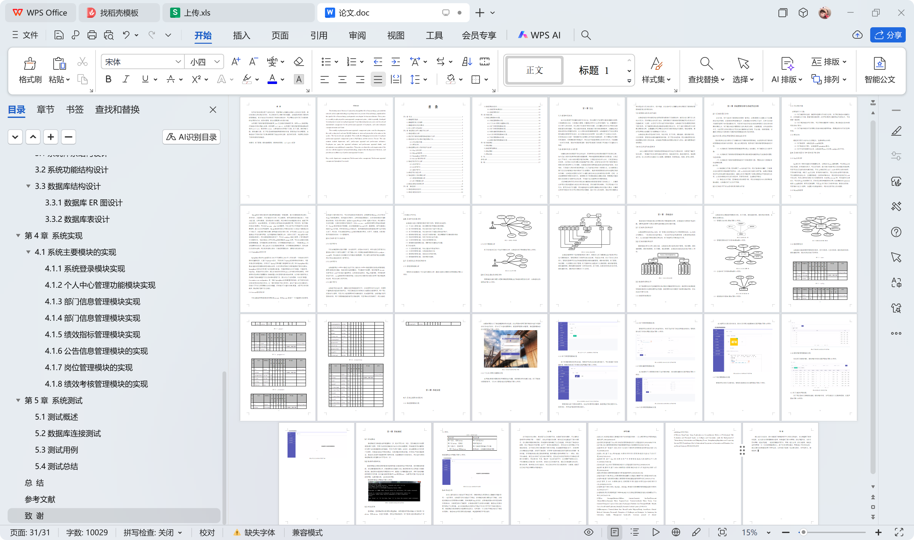

# springboot009-基于SpringBoot的月度员工绩效考核管理系统

>  博主介绍：
>  Hey，我是程序员Chaers，一个专注于计算机领域的程序员
>  十年大厂程序员全栈开发‍ 日常分享项目经验 解决技术难题与技术推荐 承接各类网站设计，小程序开发，毕设等。
>  【计算机专业课程设计，毕业设计项目，Java，微信小程序，安卓APP都可以做，不仅仅是计算机专业，其它专业都可以】

## 本项目获取地址：https://www.bishecode.com/product/9/

## 3000套系统可挑选，获取链接：https://www.bishecode.com/

### 系统架构

> 前端：html | js | css | jquery | vue
>
> 后端：springboot | mybatis
> 
> 环境：jdk1.8+ | mysql | maven

# 一、内容包括
包括有  项目源码+项目论文+数据库源码+答辩ppt+远程调试成功

# 二、运行环境

> jdk版本：1.8 及以上； ide工具：IDEA； 数据库: mysql5.7及以上；编程语言: Java

# 三、需求分析

 古往今来，对于企业员工绩效考核的管理一直存在，主要的管理方式就是人工加计算机结合进行管理。在签到中采用签到机进行，在数据统计中采用人工进行。这种方式的缺点就是不能用于中大型规模的公司，而且对于效益好的企业来说这种管理方式也非常的浪费时间和人力。对于每次的统计都需要多人参与和多次核对，出错率较高。在科技发展的今天，这些不同分类的信息完全可以交由计算机来进行处理，不会出错，效率还很高，计算机与网络结合的月度员工绩效考核管理系统的优点非常明显。

# 四、功能模块

根据系统分析中分析出来的功能，本系统的主要功能包括部门管理、岗位管理、绩效指标管理、绩效考核管理、员工管理、通知管理等。本系统的功能结构设计如下图所示

# 五、部分效果图展示

图5.1系统登录模块界面实现【本模块界面加入了系统标题和角色的选择，在本界面中采用了图形和控件进行合理摆放的方法进行设计，还加入了合适的背景图片，使登录界面更加的直观。】

图5.2个人中心管理模块实现界面【本界面主要是对管理员账号和密码进行设置，是管理员角色的操作功能，员工不能添加管理员账号】

图5.3管理员添加部门信息实现界面【部门信息是管理员角色的功能，管理员可以为企业添加新的部门，可以查询部门的创建时间，管理员添加部门信息】

图5.4管理员添加员工信息界面实现【管理员可以在新员工招入时进行添加，对员工进行部门的安排和备注的添加。】

图5.5添加绩效指标模块的界面实现【本功能是为了方便管理员对员工进行绩效考核，添加绩效指标的实现界面如下】

图5.6添加公告模块的实现界面【本功能可以实现公告的发布，添加公告信息功能模块的实现界面如下】

图5.7查询岗位信息的实现界面【管理员可以对员工分配岗位，管理员查询岗位的实现界面如下】

图5.8绩效考核信息界面【发布员工的绩效考核，绩效考核信息的实现界面如下】

 <b>完整文章</b>

 

## 本项目获取地址：https://www.bishecode.com/product/9/

## 3000套系统可挑选，获取链接：https://www.bishecode.com/

